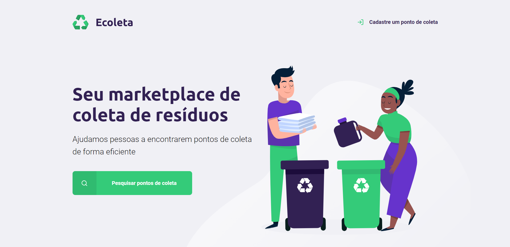

<h1 align="center">
    Ecoleta
</h1>

<h1>

</h1>

# 📋 About

A project that I developed during NLW classes. It's a recycling marketplace. Here you can search for the nearest location where you can send your recyclable waste. You can also register your recycling company and wait until someone gets in touch. This website is also responsive in different screen sizes.

<h1>

</h1>

<h1 align="center">

</h1>

# 💻 Features 

This project was developed with:
- [HTML](https://developer.mozilla.org/en-US/docs/Web/HTML)
- [CSS](https://developer.mozilla.org/en-US/docs/Web/CSS)
- [JavaScript](https://developer.mozilla.org/en-US/docs/Learn/Getting_started_with_the_web/JavaScript_basics)
- [Node.js](https://nodejs.org/en/)
- [SQLite](https://www.sqlite.org/index.html)
- [Express](https://expressjs.com/pt-br/)
- [Nunjucks](https://mozilla.github.io/nunjucks/)

---

# 📂 Getting started
```bash

# Clone this repository using
$ git clone https://github.com/jpautran/ecoleta

# Move yourself to the directory
$ cd file/path

# Install the dependencies
$ npm install

# Start with
$ npm start

```

---

<h3 align="center">
Developed by João Paulo Autran 🚀
</h3>            